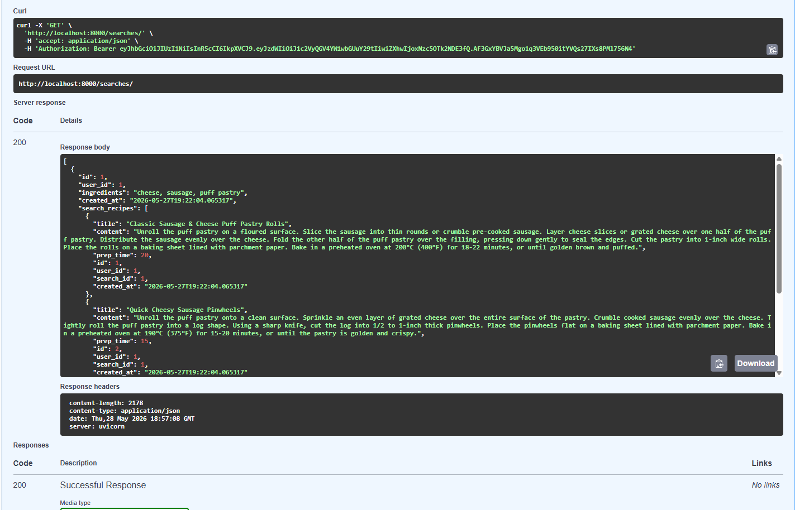
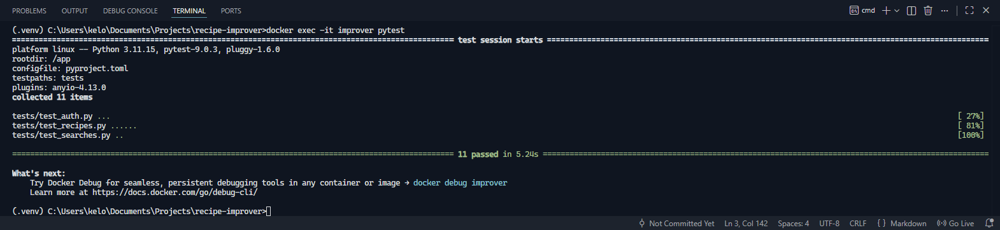

# Recipe Improver
Recipe Improver is a REST API used for managing cooking recipes. Its key functionality is generating AI-based recipes using provided ingredients.
You can search for recipes and browse your search history. You may add your own recipes. You can perform all CRUD operations on your recipes.

## Features

- JWT Authorization & Authentication
- Google Gemini AI Integration
- Search history
- Integration tests

## Showcase




## Installation

### 1. Clone the repository

- git clone https://github.com/Kelooo0/recipe-improver.git
- cd recipe-improver

### 2. Create .env file

- Using .env.example file create .env file
- Change SECRET_KEY to a safe and long string of characters
- Set API_KEY to your gemini api key created at: https://aistudio.google.com/


### 3. Run the application

1. First download and run docker desktop app
2. Make sure you docker Docker Desktop app is running
3. Choose one of the options below to run in your designated terminal
    - Development Variant: docker compose up --build
    - Production Variant: docker compose -f docker-compose.yml -f docker-compose.prod.yml up -d --build
4. After running the app go to localhost:8000/docs on dev variant or localhost:80/docs on prod variant
5. Then after you register and sign in you can test all endpoints using swagger

## Project structure

```text
recipe-improver/
├── alembic/
├── app/
│   ├── routers/                        # FastAPI routers
│   │   ├── auth.py
│   │   ├── recipes.py
│   │   └── searches.py
│   ├── services/                       # Services folder
│   │   ├── ai_service.py
│   │   ├── auth_service.py
│   │   ├── recipes_service.py
│   │   └── searches_service.py
│   ├── __init__.py
│   ├── config.py                       # All app settings
│   ├── database.py                     # Database configuration
│   ├── main.py                         # App initialization file
│   ├── models.py                       # Database models file
│   └── schemas.py                      # Pydantich data schemas
├── assets/                             # Project documentation
│   └── img/
├── tests/                              # Pytest unit tests
│   ├── conftest.py
│   ├── test_auth.py
│   ├── test_recipes.py
│   └── test_searches.py
├── .env.example
├── .gitignore
├── alembic.ini
├── docker-compose.yml                  # Docker multi-container setup
├── Dockerfile                          # App contenerization configuration
├── pyproject.toml                      # Pytest configuration
├── README.md
└── requirements.txt
